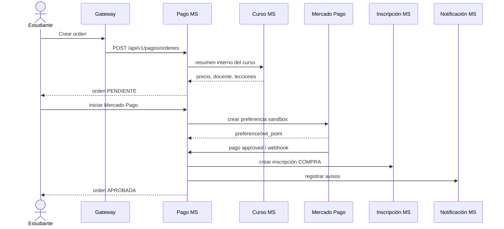

# Avance técnico de Midwar

## Flujo principal implementado

## Dinero del docente

Por cada venta aprobada se genera un movimiento de `montoDocente = total - comisión`. El movimiento empieza `PENDIENTE` y se vuelve `DISPONIBLE` después de 7 días. Un retiro genera un movimiento negativo reservado para impedir dobles retiros. Si el administrador lo rechaza, esa reserva se revierte; si lo paga, permanece en el historial como egreso pagado.

## Reembolso

La solicitud consulta el progreso real de Inscripciones. Se acepta únicamente si la orden está aprobada, no han transcurrido más de 7 días y el progreso es como máximo 20 %. La aprobación revoca el acceso y revierte el movimiento de la venta.

## Mercado Pago

No se guarda ningún token en Git. El token sandbox se coloca en `.env` como `MERCADO_PAGO_ACCESS_TOKEN=TEST-...`. Si aún no se cuenta con credenciales, el entorno local permite demostrar el flujo con `/api/v1/pagos/ordenes/{id}/simular-aprobacion`. En un despliegue real esa simulación debe quedar deshabilitada.
