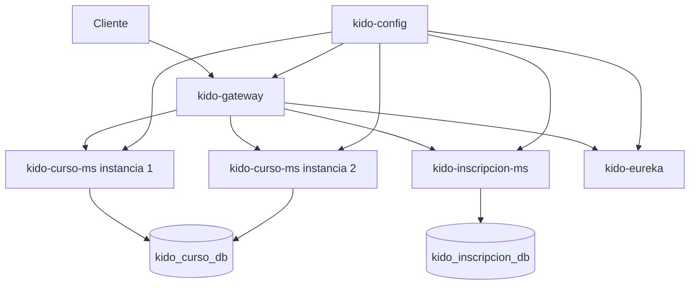

# Kido - Producto de Unidad 1

## Producto

Sistema distribuido base de Kido, funcional, configurable y preparado para múltiples instancias.

## 1. Alcance de servicios

| Servicio | Responsabilidad | Evidencia |
|---|---|---|
| `kido-config` | Entrega configuración según el ambiente | Archivos `-dev.yml` y `-prod.yml` |
| `kido-eureka` | Registra y descubre servicios | Dashboard con instancias UP |
| `kido-gateway` | Recibe todo el tráfico externo | Rutas `lb://kido-curso-ms` y `lb://kido-inscripcion-ms` |
| `kido-curso-ms` | Administra cursos gratuitos y pagados | CRUD completo y dos instancias |
| `kido-inscripcion-ms` | Registra acceso y avance por lección | Cabecera Inscripcion y detalle ProgresoLeccion |

## 2. Contrato REST

Todos los endpoints de negocio se prueban mediante `http://localhost:18080`.

| Método | Ruta | Resultado |
|---|---|---|
| GET | `/api/v1/cursos` | Lista cursos |
| GET | `/api/v1/cursos/{id}` | Obtiene un curso o responde 404 |
| POST | `/api/v1/cursos` | Crea un curso o responde 400 |
| PUT | `/api/v1/cursos/{id}` | Actualiza un curso |
| DELETE | `/api/v1/cursos/{id}` | Elimina un curso no publicado |
| GET | `/api/v1/inscripciones` | Lista inscripciones y progreso |
| GET | `/api/v1/inscripciones/{id}` | Obtiene una inscripción o responde 404 |
| POST | `/api/v1/inscripciones` | Crea una inscripción gratuita con sus lecciones |
| PUT | `/api/v1/inscripciones/{id}/estado` | Cambia el estado |
| PUT | `/api/v1/inscripciones/{id}/lecciones/{leccionId}/completar` | Registra progreso |
| DELETE | `/api/v1/inscripciones/{id}` | Elimina la inscripción y sus detalles |

## 3. Persistencia y reglas

`kido-curso-ms` usa `kido_curso_db`. Sus tablas son categorias, cursos, modulos y lecciones. Un curso GRATUITO debe costar cero; uno PAGO debe costar más de cero.

`kido-inscripcion-ms` usa `kido_inscripcion_db`. Inscripcion es la cabecera y ProgresoLeccion es el detalle. La combinación estudiante-curso es única. Una lección solo puede completarse si la inscripción está activa.

En S5 solo se permite crear por HTTP el acceso GRATUITO. El acceso COMPRA se conectará al evento de pago aprobado durante la Unidad 2.

## 4. Configuración por ambiente

| Componente | DEV | PROD en Docker |
|---|---:|---:|
| Config Server | 18888 | 8888 interno, 18888 en host |
| Eureka | 18761 | 8761 interno, 18761 en host |
| Gateway | 18080 | 8080 interno, 18080 en host |
| Curso | 8080 y 8081 | 8080 interno, dos contenedores |
| Inscripción | 8082 | 8080 interno |
| PostgreSQL Curso | 15432 | 5432 interno |
| PostgreSQL Inscripción | 15434 | 5432 interno |

DEV muestra SQL y detalles de health. PROD oculta Swagger, no muestra SQL ni detalles internos. Las credenciales de PROD se reciben por variables.

## 5. Arquitectura

Gateway consulta Eureka y Spring Cloud LoadBalancer elige una instancia de Curso con round-robin. Si una instancia deja de estar disponible, Eureka actualiza el registro y Gateway deja de seleccionarla después del intervalo de detección.

## 6. Evidencias que deben capturarse

1. `docker compose ps` con todos los componentes en ejecución.
2. Configuración DEV y PROD consultada en Config Server.
3. Dashboard de Eureka con dos instancias de KIDO-CURSO-MS.
4. GET, POST, PUT y DELETE de Curso mediante Gateway.
5. POST inválido con curso GRATUITO y precio mayor a cero, respuesta 400.
6. Varias llamadas GET con valores diferentes en `X-Instance-ID`.
7. Una instancia detenida y nuevas llamadas atendidas por la restante.
8. Repositorio, topics académicos y esta documentación publicada.

## 7. Correspondencia con la rúbrica

| Criterio S5 | Evidencia de Kido |
|---|---|
| REST funcional y persistente | Curso e Inscripción con PostgreSQL y Flyway |
| Configuración externa | Config Server con DEV y PROD |
| Registro y descubrimiento | Eureka con instancias UP |
| Gateway | Rutas de ambos microservicios |
| Distribución de tráfico | Dos instancias de Curso y encabezado X-Instance-ID |
| Reproducibilidad y documentación | Docker Compose, README, MkDocs y guion |
| Sustentación | Demostración individual de Adan y explicación de su código |

## 8. Rúbrica para revisar antes de presentar

| Criterio | Peso | Evidencia para obtener el nivel más alto |
|---|---:|---|
| Servicio REST funcional y persistente | 12 % | Servicio ejecutable, persistente y documentado, verificado en vivo |
| Configuración externa por ambiente | 12 % | DEV y PROD externos, diferentes y verificables |
| Registro y descubrimiento | 16 % | Eureka operativo con las instancias visibles |
| Punto único de acceso | 16 % | Gateway operativo con rutas a todos los servicios actuales |
| Distribución de tráfico | 16 % | Balanceo claro entre dos instancias |
| Evidencia y documentación | 8 % | Otra persona puede ejecutar el sistema siguiendo el README |
| Sustentación | 20 % | Cada integrante demuestra su aporte y responde con claridad |

La sustentación también revisa aporte individual, comunicación, orden, presentación personal, repositorio con topics, MkDocs y pitch o demo ejecutiva.
